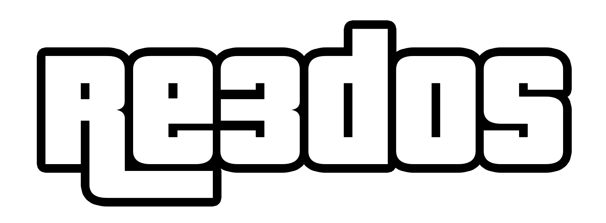
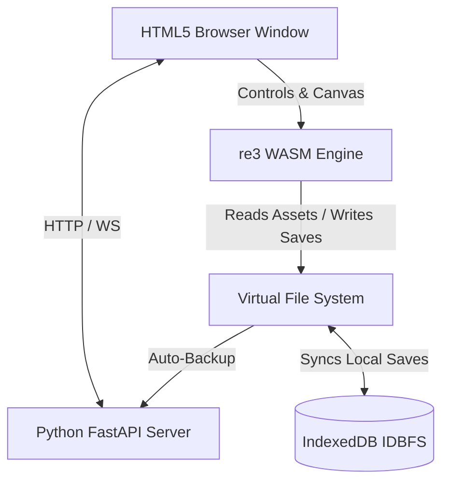
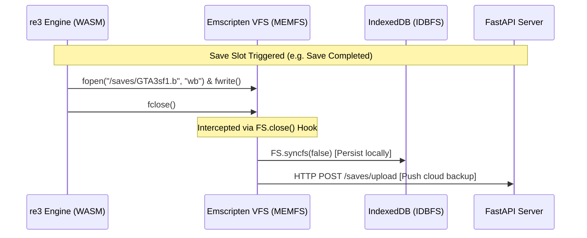

<p align="center">
  
</p>

re3DOS is a high-performance WebAssembly port of the open-source **re3** engine (Grand Theft Auto III), enabling native execution of the game directly inside modern web browsers. The project packages the reverse-engineered engine with a lightweight, secure FastAPI server that orchestrates assets delivery and persistent game state synchronization.


## Features

- **Native Browser Execution**: Compiled to WebAssembly using Emscripten, targeting WebGL2/ES3 for graphics and OpenAL Soft for spatial 3D audio.
- **Complete Input Mappings**: Full support for raw keyboard/mouse events (including mouse scroll weapon-switching) and standard HTML5 Gamepad API controller mappings.
- **Local Persistence (IDBFS)**: Automatic mounting of the browser's IndexedDB to the virtual filesystem, keeping your local saves persistent across sessions.
- **FastAPI Sync Server**: Dynamic cloud backup and restoration of individual save slots mapped by a unique profile token.


## System Architecture

The project decouples the game engine environment from the host server, split into two main layers:



### 1. WebAssembly Core (re3.wasm / game.js)
* **Graphics Wrapper**: Uses `librw` compiled with a WebGL2/GLES3 backend to pipe RenderWare rendering pipelines to the HTML5 Canvas.
* **Audio Engine**: OpenAL Soft compiled to WebAssembly, routing multi-channel game streams (effects and radio) to the browser's Web Audio API.
* **Virtual Directory Tree**:
  - `/gamefiles/`: Preloaded static game assets (textures, models, maps, script, and audio).
  - `/saves/`: Mounted IndexedDB path hosting virtual save files (`GTA3sf1.b` to `GTA3sf8.b`).
* **Saves Hook**: Intercepts low-level `close` calls via the Emscripten filesystem API to instantly commit data back to IndexedDB and push backup uploads to the server.

### 2. FastAPI Host Server (server.py)
* **Security Middleware**: Configures strict HTTP response headers (`Cross-Origin-Opener-Policy: same-origin` and `Cross-Origin-Embedder-Policy: require-corp`) required by modern browsers to allocate shared array buffers for WebAssembly.
* **Save Router (`additions/saves.py`)**: Hosts API endpoints to process multipart form uploads and file downloads for slot syncing.




## Getting Started

### Prerequisites

Ensure the following dependencies are installed:
- Python 3.10+
- CMake (for building the WASM toolchain)
- Git


### 1. Prepare Game Assets

The compiler preloads assets from the `build/gta3-assets` folder. Create it and populate it with files from your original GTA III PC installation:

```bash
mkdir -p build/gta3-assets
```

Copy the following directories into `build/gta3-assets/`:
- `models/`, `data/`, `TEXT/`, `audio/`, `anim/`, `txd/`, `skins/`

*Note: For the in-game radio stations to function, copy the original full-sized `.wav` files (e.g. `HEAD.wav`, `CHAT.wav` ~50MB+) from your GTA III audio folder rather than compressed placeholder rips.*


### 2. Build the Project

Run the build script to compile the C++ codebase and bundle the assets:

```bash
./build/build.sh [options]
```

#### Build Parameters:
| Flag | Description |
|---|---|
| `--skip-emsdk` | Skips installing/updating the Emscripten SDK (uses local cache). |
| `--skip-clone` | Skips re-cloning the `re3` codebase (preserves local modifications). |
| `--skip-librw` | Skips cloning/building the render helper library. |
| `--assets <PATH>` | Uses a custom path for game assets (defaults to `build/gta3-assets/`). |

*Example (Incremental Build):*
```bash
./build/build.sh --skip-emsdk --skip-clone --skip-librw
```


### 3. Run the Server

Launch the web server with custom save syncing enabled:

```bash
python server.py --re3sky_local re3sky --custom_saves --port 8001
```

Once running, navigate to:
**[http://localhost:8001](http://localhost:8001)**
